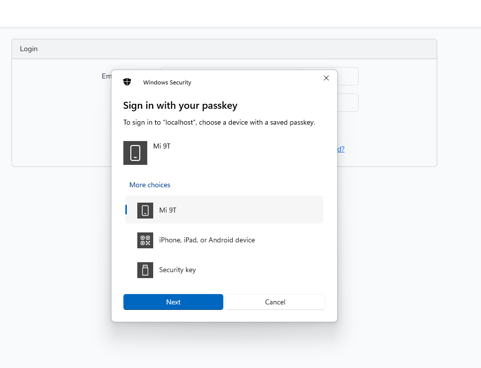
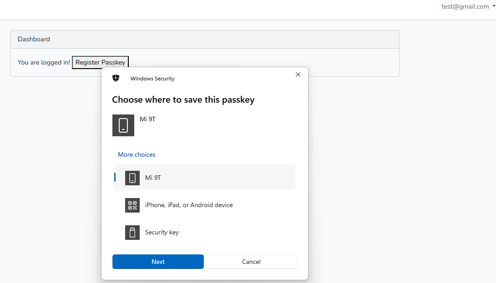

# Laravel WebAuthn with Webpass

This project integrates WebAuthn (passkeys authentication) into a Laravel 11 project using Webpass, inspired by [Laragear/WebAuthn](https://github.com/Laragear/WebAuthn).

## Features
- WebAuthn authentication with Passkeys.
- Integration with Laravel's authentication system.
- Using Webpass for JavaScript WebAuthn handling.
## Demo: Login with Authenticated Device

Below is an example of the login screen where users can sign in using their passkey:



- Users can select a device with a saved passkey to authenticate.
- Options include devices like  **iPhone, iPad, or Android device**, or a **Security key**.
## Demo: Register New Device

Below is an example of registering new device:



- Options include devices like  **iPhone, iPad, or Android device**, or a **Security key**.
## Requirements
- **Laravel 11.x** or later.
- **PHP 8.1** or later.
- The `ext-openssl` extension.
- The `ext-sodium` extension (optional, for EdDSA 25519 public keys).

> If you can't enable the `ext-sodium` extension, you may try installing `paragonie/sodium_compat`.

## Installation

1. **Install the required package:**

   ```bash
   composer require laragear/webauthn
   ```

2. **Publish the WebAuthn configuration files and migrations:**

   ```bash
   php artisan webauthn:install
   ```

3. **Run the migration to create the necessary table:**

   ```bash
   php artisan migrate
   ```

4. **Configure the WebAuthn User Provider:**

   In your `config/auth.php`, update the `users` provider as follows:

   ```php
   'providers' => [
       'users' => [
           'driver' => 'eloquent-webauthn',
           'model' => App\Models\User::class,
           'password_fallback' => true,
       ],
   ],
   ```

   The `password_fallback` option ensures that both password and WebAuthn authentication are supported seamlessly.

5. **Update the User Model:**

   In your `User` model, implement the `WebAuthnAuthenticatable` contract and use the `WebAuthnAuthentication` trait:

   ```php
   namespace App\Models;

   use Illuminate\Foundation\Auth\User as Authenticatable;
   use Laragear\WebAuthn\Contracts\WebAuthnAuthenticatable;
   use Laragear\WebAuthn\WebAuthnAuthentication;

   class User extends Authenticatable implements WebAuthnAuthenticatable
   {
       use WebAuthnAuthentication;
   }
   ```

6. **Register Routes for WebAuthn:**

   In your `routes/web.php`, register the WebAuthn routes by calling `WebAuthnRoutes::register()`:

   ```php
   use Illuminate\Foundation\Http\Middleware\VerifyCsrfToken;
   use Illuminate\Support\Facades\Route;
   use Laragear\WebAuthn\Http\Routes as WebAuthnRoutes;

   Route::view('welcome');

   // WebAuthn Routes
   WebAuthnRoutes::register()->withoutMiddleware(VerifyCsrfToken::class);
   ```

   **Important Note for Laravel 11:**

   For Laravel 11, you need to update the `app.php` configuration to disable CSRF protection for WebAuthn routes. Add the following in the `config/app.php` file:

   ```php
   use Illuminate\Foundation\Application;
   use Illuminate\Foundation\Configuration\Exceptions;
   use Illuminate\Foundation\Configuration\Middleware;

   return Application::configure(basePath: dirname(__DIR__))
       ->withRouting(
           web: __DIR__.'/../routes/web.php',
           commands: __DIR__.'/../routes/console.php',
           health: '/up',
       )
       ->withMiddleware(function (Middleware $middleware) {
           $middleware->validateCsrfTokens(except: [
               'webauthn/*',  // Disable CSRF protection for WebAuthn routes
           ]);
       })
       ->withExceptions(function (Exceptions $exceptions) {
           //
       })->create();
   ```

## WebAuthn Login Routes

For logging in with existing devices, add these routes in `web.php`:

```php
Route::prefix('webauthn')->group(function () {
    Route::post('/login/options', [WebAuthnLoginController::class, 'options']);
    Route::post('/login', [WebAuthnLoginController::class, 'login']);
});
```

## WebAuthn Registration Routes (Admin-Only)

For admin users to register new devices, add the following routes:

```php
Route::middleware('auth')->group(function () {
    Route::get('/passkeys', [WebAuthnRegisterController::class, 'index'])->name('passkeys.index'); // Listing existing passkeys in a table  
    Route::prefix('webauthn')->group(function () {
        Route::post('/register/options', [WebAuthnRegisterController::class, 'options']);
        Route::post('/register', [WebAuthnRegisterController::class, 'register']);
    });
});
```

## 5. Use the JavaScript Helper

This package's original JavaScript helper has been moved into its own package, called `@laragear/webpass`. You can use it directly in your HTML application by including it via JSDelivr CDN:

```html
<head>
    <script src="https://cdn.jsdelivr.net/npm/@laragear/webpass@2/dist/webpass.js" defer></script>
</head>

<body>
    <script async>
        if (Webpass.isUnsupported()) {
            alert("Your browser doesn't support WebAuthn.");
        }
        
        const { success } = await Webpass.attest("/webauthn/register/options", "/webauthn/register");
        
        if (success) {
            window.location.replace("/dashboard");
        }
    </script>
</body>
```

Alternatively, you may include it in your project dependencies if you're using a frontend framework like Vue, React, Angular, or Svelte, to name a few.

For reference code, you can check `resources/views/login.blade.php` in the project.

## Install the JavaScript Helper via npm

To use the `@laragear/webpass` package in your project, install it via npm:

```bash
npm i @laragear/webpass@2
```

Once installed, you can use the `Webpass` object to attest and assert the authenticator:

```javascript
import Webpass from "@laragear/webpass";

if (Webpass.isUnsupported()) {
    return alert("Your browser doesn't support WebAuthn.");
}

// Create new credentials for a logged-in user
const { credential, success, error } = await Webpass.attest("/webauthn/register/options", "/webauthn/register");

// Check the credentials for a guest user
const { user, success, error } = await Webpass.assert("/webauthn/login/options", "/webauthn/login");
```

The `Webpass` helper offers more flexibility than just adjusting the WebAuthn ceremony paths. For more information, check the [documentation of @laragear/webpass](https://github.com/laragear/webpass).

---

## Attestation

Attestation is the ceremony to create WebAuthn credentials. To create an attestable response that the user device can understand, use the `AttestationRequest::toCreate()` form request.

For example, you can create your own `WebAuthnRegisterController` to handle this:

```php
// app/Http/Controllers/WebAuthn/WebAuthnRegisterController.php
use Laragear\WebAuthn\Http\Requests\AttestationRequest;

public function createChallenge(AttestationRequest $request)
{
    return $request->toCreate();
}
```

The device will receive the "instructions" to create a key and respond with it. You can use the `AttestedRequest` form request and its `save()` method to persist the WebAuthn key if it is valid. The request will automatically return a `Validation` exception if something fails.

```php
// app/Http/Controllers/WebAuthn/WebAuthnRegisterController.php
use Laragear\WebAuthn\Http\Requests\AttestedRequest;

public function register(AttestedRequest $attestation)
{
    $attestation->save();
    
    return 'Now you can log in without passwords!';
}
```

You may pass an array or a callback to the `save()` method, which allows you to modify the underlying WebAuthn Eloquent model before saving it. For example, you could add an alias for the key present in the request data:

```php
// app/Http/Controllers/WebAuthn/WebAuthnRegisterController.php
use Laragear\WebAuthn\Http\Requests\AttestedRequest;

public function register(AttestedRequest $request)
{
    $request->validate(['alias' => 'nullable|string']);

    $attestation->save($request->only('alias'));
    
    // Same as:
    // $attestation->save(function ($credentials) use ($request) {
    //    $credentials->alias = $request->input('alias');
    // });
}
```

**Important:**  
Both `AttestationRequest` and `AttestedRequest` require the authenticated user. If the user is not authenticated, an HTTP 403 status code will be returned.

---

### Attestation User Verification

By default, the authenticator decides how to verify the user when creating a credential. Some may ask to press a "Continue" button to confirm presence, while others may verify the user with biometrics, patterns, or passwords.

You can override this behavior using `fastRegistration()` to only check for user presence or `secureRegistration()` to actively verify the user.

```php
// app/Http/Controllers/WebAuthn/WebAuthnRegisterController.php
use Laragear\WebAuthn\Http\Requests\AttestationRequest;

public function createChallenge(AttestationRequest $request)
{
    return $request->fastRegistration()->toCreate();
}
```

---

### Userless/One-Touch/Typeless Login

This feature enables one-click/tap login without requiring the user to input their credentials (like an email) beforehand.

For this to work, the device must save the "username ID" internally. Some authenticators may save it by default, while others may not be compatible. To make this mandatory when creating the WebAuthn credential, use the `userless()` method of the `AttestationRequest` form request.

```php
// app/Http/Controllers/WebAuthn/WebAuthnRegisterController.php
use Laragear\WebAuthn\Http\Requests\AttestationRequest;

public function registerDevice(AttestationRequest $request)
{
    return $request->userless()->toCreate();
}
```

In simpler terms, once the Resident Key is created, the authenticator can find the correct credential for your app by matching credentials with your Relaying Party ID (e.g., `my-app.com`). This eliminates the step of the user sending their username so the server can return the credential IDs the authenticator should use.

**Important:**  
The authenticator WILL require user verification on login when using `userless()`. It is highly probable that the user will also be asked for verification during login, depending on the authenticator itself.

---

### Multiple Credentials per Device

By default, during attestation, the device is informed about existing enabled credentials already registered in the application. This prevents the device from creating duplicate credentials.

You can enable multiple credentials per device using `allowDuplicates()`, which will return an empty list of credentials to exclude. This way, the authenticator will assume no credentials are stored for your app and create a new one.

```php
// app/Http/Controllers/WebAuthn/WebAuthnRegisterController.php
use Laragear\WebAuthn\Http\Requests\AttestationRequest;

public function registerDevice(AttestationRequest $request)
{
    return $request->allowDuplicates()->toCreate();
}
```

---

## Assertion

The assertion procedure also follows a two-step process: the user inputs their username, the server returns the IDs of the WebAuthn credentials to use, and the device picks one to sign the response. If you're using userless login, only the challenge is returned.

First, use the `AssertionRequest::toVerify()` form request. It will automatically create an assertion for the user matching the credentials or a blank one if you're using userless login. You can also set stricter validation rules to always ask for credentials.

For example, you can use your own `WebAuthnLoginController` to handle this:

```php
// app/Http/Controllers/WebAuthn/WebAuthnLoginController.php
use Laragear\WebAuthn\Http\Requests\AssertionRequest;

public function createChallenge(AssertionRequest $request)
{
    $request->validate(['email' => 'sometimes|email']);

    return $request->toVerify($request->only('email'));
}
```

After that, you can receive the challenge using the `AssertedRequest` request object by type-hinting it in the controller.

Since the authentication is straightforward, you only need to check if the `login()` method returns the newly authenticated user or `null` if it fails. On success, it will regenerate the session for you.

```php
// app/Http/Controllers/WebAuthn/WebAuthnLoginController.php
use Laragear\WebAuthn\Http\Requests\AssertedRequest;

public function login(AssertedRequest $request)
{
    $user = $request->login();
    
    return $user 
        ? response("Welcome back, $user->name!")
        : response('Something went wrong, try again!');
}
```

You can also use the `login()` method with callbacks, which will be passed to the `attemptWhen()` method of the Session Guard.

```php
// app/Http/Controllers/WebAuthn/WebAuthnLoginController.php
use Laragear\WebAuthn\Http\Requests\AssertedRequest;

public function login(AssertedRequest $request)
{
    $user = $request->login(callbacks: fn ($user) => $user->isNotBanned());
    
    return $user 
        ? response("Welcome back, $user->name!")
        : response('Something went wrong, try again!');
}
```

If you need greater control over the assertion procedure, you can assert manually.

---

### Assertion User Verification

Similar to attestation user verification, the authenticator decides whether to verify the user on login or not.

You can require only user presence with `fastLogin()` or actively verify the user with `secureLogin()`.

```php
// app/Http/Controllers/WebAuthn/WebAuthnLoginController.php
use Laragear\WebAuthn\Http\Requests\AssertionRequest;

public function createChallenge(AssertionRequest $request)
{
    $request->validate(['email' => 'sometimes|email']);

    return $request->fastLogin()->toVerify($request->only('email'));
}
```

---

## Password Fallback

By default, the `eloquent-webauthn` driver can be used to log in users with passwords when the credentials are not a WebAuthn JSON payload (e.g., a password). This ensures your normal authentication flow remains unaffected:

```php
// app/Http/Controllers/Auth/LoginController.php
use Illuminate\Support\Facades\Auth;

public function login(Request $request)
{
    $request->validate(['email' => 'required|email', 'password' => 'required|string']);

    if (Auth::attempt($request->only('email', 'password'))) {
        return redirect()->home();
    }
    
    return back()->withErrors(['email' => 'No user found with these credentials']);
}
```

You can disable the fallback to only allow WebAuthn authentication by setting `password_fallback` to `false`. This may require you to handle classic user/password authentication using a separate guard.

---

## Detecting Cloned Credentials

During assertion, the package will automatically detect if a credential has been cloned by comparing how many times the user has logged in with it.

When a credential is detected as cloned, it will be immediately disabled, and the assertion will be denied.

Additionally, the `CredentialCloned` event will be fired, which you can use to warn the user.

```php
use Illuminate\Support\Facades\Event;
use Laragear\WebAuthn\Events\CredentialCloned;
use App\Notifications\SecureYourDevice;

Event::listen(CredentialCloned::class, function ($cloned) {
    $notification = new SecureYourDevice($cloned->credential);
    
    $cloned->credential->user->notify($notification);
});
```
---

Here’s the updated section with the additional line for detailed documentation:
## Managing Credentials

The `WebAuthnAuthenticatable` contract allows you to manage credentials within the `User` instance. The most useful methods are:

- `webAuthnData()`: Returns the non-variable WebAuthn user data to create credentials.
- `flushCredentials()`: Removes all credentials. You can exclude credentials by their ID.
- `disableAllCredentials()`: Disables all credentials. You can exclude credentials by their ID.
- `makeWebAuthnCredential()`: Creates a new WebAuthn Credential instance.
- `webAuthnCredentials()`: A one-to-many relationship to query for WebAuthn Credentials.

You can use these methods to, for example, find a credential to blacklist or disable WebAuthn completely by flushing all registered devices.

---
## Conclusion

This setup integrates WebAuthn into your Laravel application using the `laragear/webauthn` package. It enables Passkey-based authentication for enhanced security without relying on passwords. You can now authenticate users with WebAuthn and also manage their credentials within the Laravel framework.

For detailed documentation, you can follow this link: [Laragear/WebAuthn Documentation](https://github.com/Laragear/WebAuthn).  
*Note: I followed this documentation to integrate WebAuthn, but some steps were missing in their guide.*

This addition ensures users know where to find the official documentation while acknowledging that some steps might be missing. Let me know if you need further adjustments! 😊

